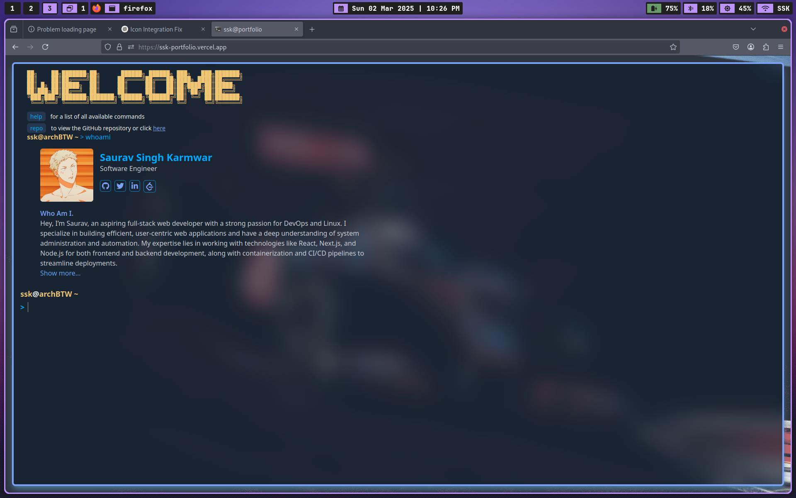

# My Portfolio Terminal

Welcome to **My Portfolio Terminal**! This interactive web application serves as a unique showcase for my skills, projects, and experiences, all presented in a terminal-like interface. Built with React.js, the project aims to create a modern, user-friendly experience.

## Features

- **Interactive Commands**: Enter commands like `about`, `projects`, `experience`, and more to explore different sections of the portfolio.
- **Dynamic Content**: Each command generates dynamic output, providing an engaging way to present information.
- **Responsive Design**: The application is designed to be responsive and looks great on all devices.

## Technologies Used

- **Frontend**: React.js
- **Styling**: Tailwind CSS (for modern UI components)
- **State Management**: Recoil (for managing global state)
- **Deployment**: Vercel

## Future Enhancements

In the near future, I plan to enhance this portfolio by adding a backend using Express.js and a database to store project information dynamically. This will allow for more extensive data management and functionality.
